# PulseGuard IoT

## Smart Heart Rate Monitoring and Analysis System

---

# 1. 專題簡介

PulseGuard IoT 是一套結合物聯網（IoT）、雲端運算與資料分析的智慧健康監測系統。

系統透過 MAX30102 感測器量測使用者心率（BPM）與血氧濃度（SpO₂），利用 MQTT 將資料即時傳送至雲端，並進行健康狀態分析、資料儲存與視覺化呈現。

---

# 2. 專題目標

* 即時量測 BPM 與 SpO₂
* TFT 顯示量測結果
* LED 顯示健康狀態
* 蜂鳴器提示心跳與警示
* MQTT 即時資料傳輸
* Web Dashboard 即時監控
* MongoDB Atlas 雲端儲存
* Python 健康分析
* Streamlit 視覺化分析
* LINE Notify 量測報告推播

---

# 3. 系統架構

```mermaid
graph TD
    subgraph Edge_Device [Edge Device - ESP32]
        E1[MAX30102 Sensor Sampling<br/>感測器採樣]
        E2[Finger Detection Check<br/>手指偵測檢查]
        E3[Edge Filtering & State Determination<br/>邊緣濾波與狀態判定]
        E4[Real-time Feedback<br/>即時 LED/BUZZER/TFT 回饋]
        E5[Send MQTT Data<br/>發送 MQTT 資料]
        E1 --> E2 --> E3 --> E4 --> E5
    end

    subgraph Cloud_Backend ["Cloud Backend - Python"]
        B1["MQTT Subscription Center<br/>MQTT 訂閱中心"]
        B2["Session Lifecycle Management<br/>會話生命週期管理"]
        B3["EMA Calculation<br/>EMA 指數降噪計算"]
        B4["Smart DB Persistence Strategy<br/>Smart DB 寫入策略決策"]
        B1 --> B2 --> B3 --> B4
    end

    subgraph User_Interface ["User Interface"]
        subgraph Real_time_UI [Real-time Monitoring]
            U1["Web Dashboard (MQTT.js)<br/>即時網頁儀表板"]
        end

        subgraph Analytics_UI [Streamlit Dashboard]
            U2["Trend Charts<br/>趨勢圖表"]
            U3["Abnormal Log Export<br/>異常日誌匯出"]
        end

        U4["LINE Flex Message Notification<br/>LINE 訊息通知"]
    end

    DB[(MongoDB Atlas)]

    E5 -- "MQTT Protocol" --> B1
    E5 -- "MQTT Protocol" --> U1
    B4 -- "Write" --> DB
    B4 -- "LINE Messaging API" --> U4
    DB -- "Read" --> U2
    DB -- "Read" --> U3

    style Edge_Device fill:#00331a,stroke:#00E676,stroke-width:2px
    style Cloud_Backend fill:#003333,stroke:#00E5FF,stroke-width:2px
    style User_Interface fill:#1a1d23,stroke:#D1D5DB,stroke-width:2px
    style DB fill:#1a1a1a,stroke:#4DB33D,stroke-width:2px
```



---

# 4. 使用技術

| 類別                | 技術                        |
| ----------------- | ------------------------- |
| MCU               | ESP32                     |
| Sensor            | MAX30102                  |
| Protocol          | MQTT                      |
| MQTT Broker       | HiveMQ Cloud              |
| Dashboard         | HTML + MQTT.js + Chart.js |
| Backend           | Python                    |
| Database          | MongoDB Atlas             |
| Data Analysis     | Pandas                    |
| Visualization     | Streamlit                 |
| Notification      | LINE Messaging API        |
| Cloud Deployment  | Railway                   |
| Dashboard Hosting | Streamlit Community Cloud |

---

# 5. 使用硬體

| 元件            | 用途      |
| ------------- | ------- |
| ESP32 NodeMCU | 主控制器    |
| MAX30102      | 心率血氧感測器 |
| TFT LCD       | 即時顯示    |
| LED ×3        | 狀態指示    |
| Active Buzzer | 提示音     |
| Push Button   | 開始/重置   |
| USB Power     | 供電      |

---

# 6. ESP32 功能

ESP32 負責：

* 心率計算
* 血氧計算
* 手指偵測
* TFT 顯示
* LED 狀態顯示
* 蜂鳴器提示
* MQTT 發送
* Wi-Fi 連線管理
* Sleep Mode

---

# 7. 量測流程

```text
按下按鈕
    │
    ▼
開始量測
    │
    ▼
每秒發送 MQTT
    │
    ▼
持續量測 30 秒
    │
    ▼
發布 COMPLETED
    │
    ▼
Python 產生報告
    │
    ▼
LINE 推播通知
    │
    ▼
Dashboard 清空
    │
    ▼
ESP32 Sleep
```

---

# 8. 手指偵測

透過 MAX30102 IR 值判斷是否有手指接觸。

無手指時：

```text
Finger Removed

Measurement Paused
```

系統將：

* 暫停 BPM 更新
* 暫停 SpO₂ 更新
* 暫停 MQTT 傳送
* 停止蜂鳴器

---

# 9. TFT 顯示介面

## 待機畫面

```text
PulseGuard IoT

Press Button
To Start
```

## 量測中

```text
BPM: 78

SpO₂: 98%

Status: NORMAL
```

---

# 10. LED 與蜂鳴器

## LED 狀態

| LED | 狀態      |
| --- | ------- |
| 綠燈  | NORMAL  |
| 黃燈  | WARNING |
| 紅燈  | DANGER  |

---

## 蜂鳴器

### 心跳提示

每次偵測到心跳時短響一次。

### 警示提示

| 狀態      | 提示音 |
| ------- | --- |
| NORMAL  | 1 次 |
| WARNING | 2 次 |
| DANGER  | 4 次 |

---

# 11. MQTT 架構

使用 MQTT Publish / Subscribe 架構。

Broker：

```text
HiveMQ Cloud
```

Topic：

```text
pulseguard/data
```

---

## 即時量測資料

每秒發送一次：

```json
{
  "bpm": 79,
  "spo2": 98,
  "status": "NORMAL"
}
```

---

## 提前中止量測

```json
{
  "status": "RESET"
}
```

用途：

* 清空 Dashboard
* 清空本次 Session
* 不發送 LINE 通知

---

## 完成量測

30 秒量測完成後：

```json
{
  "status": "COMPLETED",
  "duration_sec": 30
}
```

用途：

* 產生量測報告
* 發送 LINE 通知
* 結束本次 Session

---

## MQTT 分工

| 系統            | 功能        |
| ------------- | --------- |
| ESP32         | Publish   |
| Web Dashboard | Subscribe |
| Python        | Subscribe |

---

# 12. Web Dashboard

使用：

* HTML
* CSS
* MQTT.js
* Chart.js

---

## 顯示內容

### 即時資訊

* Heart Rate (BPM)
* SpO₂ (%)
* Health Status
* MQTT Status
* Last Update

### 即時圖表

* Heart Rate Trend
* SpO₂ Trend

---

## Dashboard 狀態

### Measuring

```text
Heart Rate: 78 BPM
SpO₂: 98%
Status: NORMAL
```

---

### Reset

收到：

```json
{
  "status": "RESET"
}
```

Dashboard：

* 清空圖表
* 清空數值

---

### Completed

收到：

```json
{
  "status": "COMPLETED",
  "duration_sec": 30
}
```

Dashboard：

* 清空圖表
* 等待下一次量測

---

# 13. Python 分析服務

部署平台：

```text
Railway
```

功能：

* MQTT Subscribe
* EMA 計算
* ΔBPM 計算
* Status 分析
* MongoDB 儲存
* LINE 推播

---

# 14. BPM 指數移動平均（EMA）

平滑係數：

```text
α = 0.3
```

公式：

```text
EMAₜ = 0.3 × xₜ + 0.7 × EMAₜ₋₁
```

其中：

| 變數     | 說明      |
| ------ | ------- |
| xₜ     | 當前 BPM  |
| EMAₜ₋₁ | 上一次 EMA |
| EMAₜ   | 新 EMA   |

---

# 15. 急性心率變動率（ΔBPM）

公式：

```text
|ΔBPM| = |EMAₜ − EMAₜ₋₁|
```

用於判斷短時間內心率劇烈變化。

---

# 16. 健康狀態判斷

## DANGER

```text
EMA ≤ 50
OR
|ΔBPM| ≥ 50
OR
SpO₂ ≤ 90%
```

---

## WARNING

```text
10 ≤ |ΔBPM| < 50
OR
91% ≤ SpO₂ ≤ 94%
```

---

## NORMAL

```text
|ΔBPM| < 10
AND
EMA > 50
AND
SpO₂ ≥ 95%
```

---

## Boundary Protection

其餘情況：

```text
WARNING
```

---

# 17. MongoDB Atlas

Collection：

```text
heart_rate_data
```

---

## Document 格式

```json
{
  "timestamp": "2026-06-01T20:00:00Z",
  "bpm_avg": 79.2,
  "spo2": 98,
  "delta_bpm": 3.4,
  "status": "NORMAL"
}
```

---

# 18. Streamlit Dashboard

部署平台：

```text
Streamlit Community Cloud
```

---

## 功能

* BPM 趨勢分析
* EMA 趨勢圖
* ΔBPM 趨勢圖
* SpO₂ 趨勢圖
* Status 分布統計
* 歷史資料查詢
* WARNING 統計
* DANGER 統計

---

# 19. LINE 通知

當收到：

```json
{
  "status": "COMPLETED",
  "duration_sec": 30
}
```

Python 自動產生本次 Session 報告。

---

## LINE 訊息格式

```text
📊 PulseGuard 量測報告

⏱️ 量測時長：30秒
🩺 整體評級：NORMAL

❤️ 心率
平均：78 BPM
範圍：63 ~ 112 BPM

🩸 血氧
平均：98%
範圍：95% ~ 99%

⚠️ WARNING：2 次
🚨 DANGER：0 次
```

---

# 20. 系統驗證

## Python 驗證

* MQTT 接收驗證
* EMA 計算驗證
* ΔBPM 計算驗證
* Status 判斷驗證
* MongoDB 寫入驗證

---

## Streamlit 驗證

* 資料筆數驗證
* 圖表趨勢驗證
* Status 統計驗證
* MongoDB 資料一致性驗證

---

# 21. 系統特色

* ESP32 即時健康監測
* MQTT 雲端傳輸
* HiveMQ Cloud Broker
* Web Dashboard 即時監控
* Python 健康分析
* EMA 平滑演算法
* ΔBPM 急性變動分析
* MongoDB Atlas 雲端資料庫
* Streamlit 資料視覺化
* LINE 自動量測報告

---

# 22. Future Work

* 多使用者管理
* AI 健康風險預測
* 行動 App 整合
* 長期健康趨勢分析
* 異常事件預測

---

# 23. 專題成果

PulseGuard IoT 成功整合：

* IoT 感測
* MQTT 通訊
* 雲端運算
* 健康分析
* 資料視覺化
* 即時通知

建立一套可即時監測心率與血氧變化的智慧健康監測平台。
